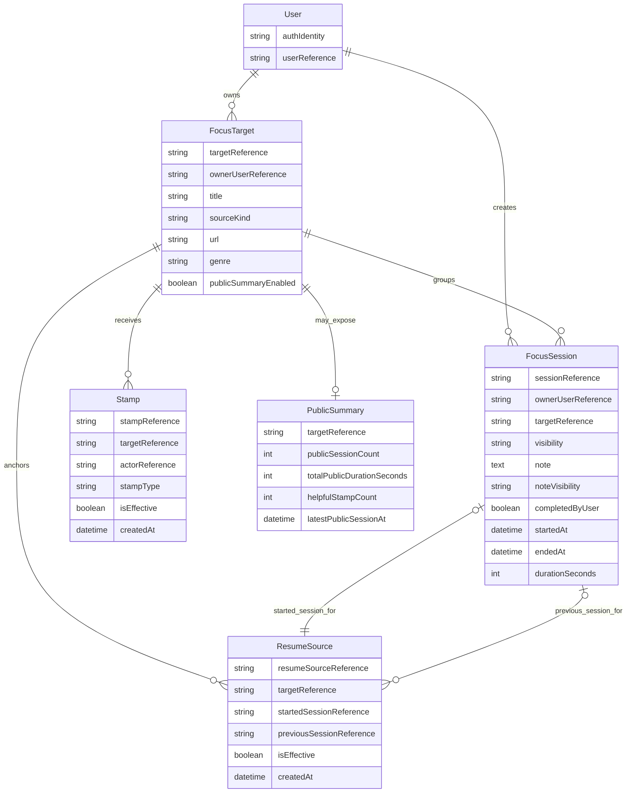

# MVP Logical ER Review

This document captures the output of issue #47.

Its purpose is to validate the current MVP domain assumptions before issue #40 turns them into the first Prisma schema.

This document does not replace the domain notes for issues #36 to #39. It reviews them together in one place.

## Scope

This review includes:

- a logical ER diagram for the MVP model
- a relationship and ownership checklist
- a sample scenario walkthrough
- a mismatch and open questions list for issue #40

This document does not define final field names, final table names, or migration details.

## Inputs used for this review

This review is based on the current public-safe design notes:

- [mvp-domain-model.md](mvp-domain-model.md)
- [mvp-visibility-rules.md](mvp-visibility-rules.md)
- [mvp-continuity-rules.md](mvp-continuity-rules.md)
- [mvp-stamp-and-summary-rules.md](mvp-stamp-and-summary-rules.md)

## Logical ER diagram

The entity names and attribute labels in this diagram are logical and illustrative only. They do not define final Prisma model names or final schema field names.

## How to read this diagram

The diagram is logical, not physical.

- `PublicSummary` is shown because it is an important public-facing concept, even though it may stay derived instead of becoming a stored table in the first schema
- `ResumeSource` is shown as the logical source of continuity, even though issue #40 may model it either as its own table or as fields on `FocusSession`
- `genre` and `note` are still shown close to their owning records because they are not yet strong candidates for separate models in the first schema

## Relationship and ownership checklist

### 1. User owns targets and sessions

Current assumption:

- one user owns many focus targets
- one user creates many focus sessions

Review result:

- this still fits the current product behavior
- ownership is stable even when session visibility changes

### 2. Target is the anchor for long-running work

Current assumption:

- a focus target groups many focus sessions
- a focus target is the anchor for public summaries
- a focus target is the anchor for helpful stamps
- a focus target is the anchor for continuity

Review result:

- this is still the correct central relation for the MVP
- target-level anchoring keeps summaries, stamps, and continuity stable across many sessions

### 3. Session is the smallest durable work record

Current assumption:

- each focus session records one focus attempt
- visibility and optional note behavior live close to the session

Review result:

- this remains correct
- session-level visibility is necessary because public summaries depend on it

### 4. Public summary is derived

Current assumption:

- a public summary is enabled explicitly per target
- visible summary content is derived from public sessions, visible notes, and visible stamp records

Review result:

- this is still the right logical model before schema design
- no contradiction was found that would force a separate stored public summary table yet

### 5. Continuity is source-driven, not counter-driven

Current assumption:

- continuity grows only from explicit resume actions
- displayed continuity should be derived from valid resume source data

Review result:

- this remains correct and safer than a blind counter
- a dedicated source concept is still needed, even if the physical model changes in #40

### 6. Stamps are target-anchored and actor-limited

Current assumption:

- the helpful stamp is anchored to `FocusTarget`
- one effective helpful stamp per actor per target is the MVP rule

Review result:

- this matches the current product intent
- this also keeps future duplicate-prevention logic straightforward

## Sample scenario walkthrough

### Scenario 1: Private target and private sessions

Expected behavior:

- target belongs to a user
- sessions exist normally
- nothing appears in public summary views

Model check:

- the current model supports this without special cases

### Scenario 2: Public summary with mixed public and private sessions

Expected behavior:

- target has public summary enabled
- only public sessions contribute to public aggregates
- private sessions stay invisible

Model check:

- the current model supports this if session visibility is treated as the source of truth for public session participation

### Scenario 3: Public session with private note

Expected behavior:

- the session can appear publicly
- the note text stays hidden

Model check:

- the current model supports this if note visibility is represented separately from session visibility or by an equivalent rule in the first schema

### Scenario 4: Resume action increases continuity

Expected behavior:

- user resumes previous work on the same target
- continuity increases for that target
- normal new session start does not increase continuity

Model check:

- the current model supports this if `ResumeSource` remains the source of truth for continuity

### Scenario 5: Resume action was a mistake

Expected behavior:

- continuity can be corrected later
- the source of truth can be updated or invalidated safely

Model check:

- the current model supports this if the resume source keeps an effective-state or equivalent correction mechanism

### Scenario 6: Helpful stamp from the same actor twice

Expected behavior:

- the target should still have only one effective helpful stamp from that actor

Model check:

- the current model supports this if the actor identity and effective-state rule are both preserved in the first schema

## Mismatch review

No major contradiction was found between issues #36 to #39.

The main remaining uncertainties are implementation choices for #40, not domain contradictions.

## Open questions for #40

### 1. Public summary persistence

The current review still supports `PublicSummary` as a derived view.

Question for #40:

- should the first schema keep this fully derived, or should it add cache fields or a dedicated persisted summary record?

### 2. Resume source storage shape

The current review still supports `ResumeSource` as a logical concept.

Question for #40:

- should the first schema store this as its own model or as resume-related fields on `FocusSession`?

### 3. Stamp actor identity

The current review supports one effective helpful stamp per actor per target.

Question for #40:

- how should authenticated and unauthenticated actors be represented in persisted data?

### 4. Note visibility representation

The current review supports note visibility being more restrictive than session visibility.

Question for #40:

- should the schema use a dedicated note visibility field, or another model that preserves the same behavior?

## Review result

The current MVP assumptions are coherent enough to move forward.

The logical ER view supports the current direction from issues #36 to #39, and the remaining questions are implementation decisions for issue #40 rather than basic domain mistakes.