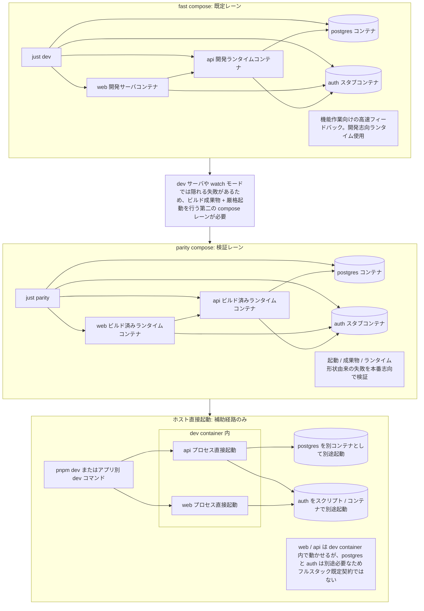

# ローカル実行レーンとドリフトポリシー

本ドキュメントは Issue #108 / #109 の成果物を統合したものである。

目的は次の 2 つを 1 本にまとめることである:

- FocusBuddy のローカル実行レーン（fast compose / parity compose / ホスト直接起動）の役割
- ローカル環境のドリフトがランタイム統合失敗を隠さないためのリポジトリレベルポリシー

実行手順そのもの（`just dev` などのコマンド）は [local-development.md](./local-development.md) を参照する。本ドキュメントはレーンが「なぜ存在し、何を維持し、何を許容するか」を扱う。

## スコープ

本ドキュメントが定めるもの:

- 現在のフルスタックローカル開発レーンと、本番志向のパリティ検証レーン
- ホスト直接起動が「補助経路」に留まる理由
- 設定カテゴリレベルのローカル env 契約
- パリティ志向の検証で維持すべき must-match ランタイムカテゴリ
- fast lane で許容される差分とその理由
- 危険なドリフトを早期に捕える最小検証ポイント
- ドキュメント / ローカルツール / CI に向けたフォローアップ指針

本ドキュメントが定めないもの: 最終的な本番インフラ、リポジトリが将来必要とするすべてのパリティチェック、コストを問わず全ローカル / ランタイム差を排除すること、低レベルの個別開発者コマンド。

## ポリシーサマリ

FocusBuddy は意図的に 2 本のローカル検証レーンを使う。

- `fast compose` は日々の開発の既定実装レーン
- `parity compose` はランタイム形状の信頼性のための狭い検証レーン

fast lane は、その差分が明示的・文書化済み・デプロイ信頼性に関わる失敗クラスを隠さない場合にのみ受け入れる。

parity 志向の検証は、must-match なランタイム挙動に関する参照ローカルレーンとする。

## 実行レーン

### `fast compose`

- 日々のローカル開発の既定経路
- 主タスクランナー `just dev` から起動する
- `docker compose` 経由でローカルスタックを動かす
- watch モードや dev サーバなど開発志向のランタイムを使う
- アプリプロセスとサポートサービスを 1 つの明示的なランタイムトポロジに揃える

### `parity compose`

- 本番志向のローカル検証経路
- `just parity` から起動する
- parity overlay と共に `docker compose` を動かす
- fast lane より厳格な起動前提で、ビルド済み成果物を実行する
- デプロイ環境でも失敗するべきドリフトを捕えるために存在する

### 補助経路: ホスト直接起動

ホスト直接起動はエスケープハッチとして残るが、第一級のフルスタックモードではない。

例: リポジトリルートからの `pnpm dev`、`apps/api` / `apps/web` を Compose 外で直接起動する。

PostgreSQL やローカル認証などのサポートサービスを別途起動する必要があり、Compose 経路と異なるランタイム形状になり、環境ドリフトを隠しやすいため、フルスタック既定として扱わない。

## レーン比較

| レーン                      | 主目的                          | ランタイム形状                                                              | 単独で不十分な理由                                                                |
| --------------------------- | ------------------------------- | --------------------------------------------------------------------------- | --------------------------------------------------------------------------------- |
| `fast compose`              | 日々の実装速度                  | Compose 管理スタック + 開発ランタイム                                       | ビルド成果物や厳格起動でしか出ない失敗を隠す可能性                              |
| `parity compose`            | 本番志向のローカル検証          | Compose 管理スタック + ビルド済みランタイム + 厳格起動                      | 日々の編集には重く、既定レーンには向かない                                       |
| ホスト直接起動              | 狭いデバッグ用エスケープハッチ | dev container 内で web / api、PostgreSQL / 認証は別途起動                   | リポジトリ既定のフルスタックトポロジから乖離する                                |

## 実行レーン図

レーン分けの本質は実行場所だけではない:

- `fast compose` ではサポートサービスとアプリランタイムが 1 本の Compose 管理レーンで起動する
- `parity compose` では fast lane が見落とす可能性のある失敗を検証できる
- ホスト直接起動では web / api を dev container から動かしても、postgres / auth は別途起動が必要であり、フルスタック既定契約とはみなさない

## 初期パリティチェック

最初のパリティ実装はレーンを狭く保ち、即時に有用な must-match チェックに集中する:

- API は watch ランナーではなく `node dist/main.js` で起動する
- web は `next dev` ではなく `next build` + `next start` で起動する
- Compose 管理の `DATABASE_URL` は明示的で、`postgres` サービスホスト名で PostgreSQL に到達する
- レーンが ready を返す前に、auth / api / web のヘルスチェックを待つ

これは完全な本番クローンより狭いが、fast lane が強制しないビルド成果物と厳格起動の挙動を既に行使する。

## 環境変数（env）契約

ローカルの追跡対象例ファイルは [.env.example](../../.env.example)。

FocusBuddy は追跡された env ファイルを「開発者が供給する設定カテゴリの真実源」とみなす。すべてのモードで最終ランタイム値が同一になることを約束しない。

### 追跡対象の入力カテゴリ

現状のローカル入力は以下のカテゴリを含む:

- PostgreSQL のデータベース名 / ユーザ / パスワード / 公開ホストポート
- API / web / auth のホストポートマッピング
- ローカル認証モード
- dev container からの Docker 利用時のオプションのバインドマウントソース上書き

これらのカテゴリは、現行の fast lane と parity lane で揃える。

### モード固有の派生値

ネットワークトポロジが異なるため、モードごとに派生値が変わるものがある。

例:

- Compose では API はサービスホスト名 `postgres` で PostgreSQL に到達する
- ホスト直接起動の補助経路では、`localhost` のような別の PostgreSQL エンドポイントが必要
- 同一モードでも、ブラウザ可視 URL とコンテナ内サービス URL は異なりうる

つまりリポジトリは、必須設定と命名をモード間で揃えつつ、ネットワーク境界が異なる場合に最終解決アドレスが違うことを許容する。

## ホスト直接起動を補助経路に留める理由

狭いデバッグや単一アプリの反復には有用だが、フルスタック主経路ではない:

- PostgreSQL や認証などのサポートサービスを自身では用意しない
- web / api を dev container から起動しても、外部依存を別途揃える必要がある
- env 結線や起動挙動が Compose スタックからドリフトしやすい
- スタックが 1 つの明示的トポロジで起動しないと、静的チェックとランタイム検証を取り違えやすい

lint / typecheck などの静的チェックは Compose スタック外でも実行できる。GitHub Actions とリポジトリルートのスクリプトが、その別レーンを既に提供している。

## must-match チェックリスト

パリティ志向の検証は、現実的な範囲で以下のカテゴリを維持または明示検証する。

### セキュリティとトランスポート

- 暗号化 / TLS が必須か無効か
- 上流が要求する場合の証明書検証挙動
- アプリケーションが見る認証 / 資格情報フローの形
- リクエスト / 接続挙動を変えうるプロトコル制約

### 接続形状とアドレッシング

- 必要な接続 URL の形状とパラメータ
- クライアントが解決すべきホスト名 / ポート
- ブラウザ / API 挙動に影響する same-origin / cross-origin 前提
- リクエスト処理を変えうるプロキシ / forwarded ヘッダ前提

### ランタイムと依存挙動

- ライブラリ / プロトコル挙動を変えうる主要ランタイムバージョン
- 挙動差が大きい場合の PostgreSQL や認証統合の主要依存バージョン
- ファイルシステム / ネットワーク / 起動挙動に影響するコンテナ vs 非コンテナ前提
- ビルド成果物起動 vs watch / dev サーバ起動

### データと状態の挙動

- 永続化 vs 一時状態の前提
- 起動時に必要なマイグレーション / スキーマ前提
- アプリ挙動が依拠するトランザクション / 整合性前提

### 失敗と readiness の挙動

- 失敗面を変えるタイムアウト / リトライ
- 起動 readiness とヘルスチェック基準
- スタブ / エミュレータ / デプロイ済みサービス間で異なる統合エラー面

## fast lane で許容される差分

fast lane は実装速度の最適化のために存在するため、明示的・文書化されている限り一部の差分を許容する。

現状の許容差分:

- watch モードや dev サーバなど開発志向ランタイム
- デプロイ DB 基盤の代わりに使うローカル Docker PostgreSQL
- 最終的なデプロイ認証統合の代わりに使うローカル認証スタブ
- dev container ワークフロー固有のローカルバインドマウントなどの開発者エルゴノミクス

これらが許容されるのは、リポジトリが parity lane も維持しているからである。

fast lane は、必要設定カテゴリを暗黙裏に再定義したり、parity が捕えるべき起動失敗を隠したり、サポートされるフルスタックワークフローと狭いホスト側デバッグの境界を曖昧にしたりしてはならない。

## 最小検証ポイント

環境センシティブな作業を安全とみなす前に、以下に答えられる必要がある。

1. parity lane でアプリは（dev ランナーではなく）ビルド成果物から起動するか
2. ランタイムは当該レーンで期待されるトポロジ経由で必要なサポートサービスを依然解決するか
3. auth / API / web が厳格起動下でいずれも healthy になるか
4. モード固有の派生値が違っても、追跡された設定カテゴリは安定か
5. 残ったドリフトは偶発ではなく明示的に文書化されているか

## 現行のリポジトリカバレッジ

Issue #108 / #109 は次の出力で実装されている。

- 本ドキュメント: 実行レーンと env 契約、ホスト直接起動の境界、must-match / 許容差分を一括で扱う
- [local-development.md](./local-development.md): fast / parity の起動コマンドと、最初に実行すべきパリティチェック
- `just dev` / `just parity`: 日々用とパリティ用の独立したローカルエントリポイント
- parity の Compose overlay: API / web のビルド済みランタイムを行使し、ヘルスチェック完了を待つ

最初のパリティチェックは意図的に狭い:

- API は watch ランナーではなくビルド成果物から起動
- web は `next build` + `next start` で起動
- Compose `DATABASE_URL` は明示で、`postgres` ホスト名で PostgreSQL に到達
- auth / API / web は parity lane で healthy 起動

完全な本番クローンではない。開発専用の起動経路が隠しうるランタイム形状ドリフトに対する最初のリポジトリレベル安全網である。

## 判断ガイド

`fast compose` を使うとき:

- 既定のフルスタックローカルワークフローが欲しい
- 主エントリポイント `just dev` を使う
- 日々の機能開発をしている
- アプリとサポートサービスを同時に起動したい

`parity compose` を使うとき:

- 本番志向のローカル検証経路が欲しい
- パリティエントリポイント `just parity` を使う
- デプロイ環境でも保たれるべき起動前提を確認する
- 開発サーバ / ゆるい起動が隠すドリフトを捕えたい

ホスト直接起動を使うのは:

- 焦点を絞ったデバッグや狭い単一アプリ作業
- サポートサービスを別途用意することを意図的に受け入れる
- リポジトリの主たるフルスタック契約として扱わない

## フォローアップ指針

### ドキュメント

- 新しいローカル / デプロイ統合が must-match カテゴリを増やしたら本ポリシーを更新する
- サポートレーンが変わったら、本ドキュメントとローカル開発ガイドを揃える
- 意図的に許容する fast lane のドリフトは、導入と同時に文書化する

### ローカルツール

- `just parity` は日常的便利機能ではなくランタイム形状ドリフトの露呈に集中させる
- 認証 / TLS / プロキシ / マネージドサービス前提が現実化したらパリティチェックを追加する
- 同じランタイム形状を提供しないなら、フルスタック主契約に見えるホスト側ショートカットを増やさない

### CI

- 環境センシティブなスモークチェックは parity 志向の検証に置く
- 認証形状 / 起動 readiness / プロトコルヘッダ / 接続パラメータなど must-match カテゴリに影響する変更には、対象を絞った CI チェックを足す
- 高速な静的チェックとパリティ志向のランタイム検証を分離し、貢献者がどちらの信頼を提供するゲートかを判別できるようにする

## フォローアップ Issue の種

想定される後続作業:

- ローカル認証スタブをより本番寄りな認証経路へ置換した時のパリティチェック拡張
- ランタイム面が拡張された際のパリティ依存の起動 / ヘルス挙動に対する CI スモークカバレッジ
- HTTPS / プロキシ / マネージドクラウド統合がローカル / デプロイ契約に入った際の must-match カテゴリ追記

## カバレッジの完了状態

本ポリシーは以下を明示的にした:

- なぜ FocusBuddy が fast / parity の検証レーンを区別するのか
- パリティ検証が維持または検証すべきランタイムカテゴリ
- 許容される fast lane の差分とその理由
- 環境ドリフトを早期に捕える最小検証ポイント
- ドキュメント / ツール / CI を整合的に保つフォローアップ指針
