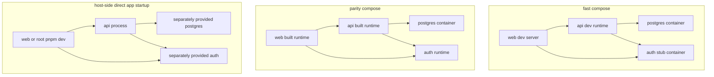

# Local Execution Modes

This document captures the output of issue #109.

Its purpose is to define the supported local execution modes for FocusBuddy and explain why host-side direct app startup is not the primary full-stack development path.

## Scope

This document defines:

- the two supported full-stack local execution modes
- the role of host-side direct app startup as an auxiliary path
- the local env contract at the configuration-category level
- a short decision guide for choosing a mode

This document does not define detailed runtime implementation changes, final production deployment, or every low-level developer command.

## Supported modes

FocusBuddy currently supports two first-class full-stack local execution modes.

### `fast compose`

- is the default day-to-day local development path
- runs the local stack through `docker compose`
- uses development-oriented runtimes such as watch mode or dev servers
- keeps supporting services and application processes in one explicit runtime topology

### `parity compose`

- is the production-oriented local validation path
- also runs through `docker compose`
- is intended to run built artifacts with stricter startup assumptions than the fast lane
- exists to catch drift that should also fail in deployed environments

## Auxiliary path

Host-side direct app startup remains available as an auxiliary escape hatch, not a first-class full-stack mode.

Examples include running `pnpm dev` from the repository root or starting `apps/api` and `apps/web` directly outside Compose.

This path is not documented as the default full-stack workflow because supporting services such as PostgreSQL and local auth must be provided separately. That changes the runtime shape from the Compose path and makes it easier to hide environment drift.

## Execution mode diagram

The important difference is not only where the processes run. In the host-side path, the developer must provide supporting services separately, so the repository cannot treat that path as the default full-stack contract.

## Env contract

The tracked local example file is [.env.example](../../.env.example).

FocusBuddy treats the tracked env file as the source of truth for developer-supplied configuration categories, not as a promise that every final runtime value is identical in every mode.

### Tracked input categories

The tracked local inputs currently cover categories such as:

- PostgreSQL database name, user, password, and exposed host port
- host port mappings for API, web, and auth
- local auth mode
- optional bind mount source override for Docker-from-dev-container workflows

These categories should stay aligned across supported modes.

### Mode-specific derived values

Some runtime values are derived differently per mode because network topology differs.

Examples:

- in Compose, API can reach PostgreSQL through the service hostname `postgres`
- in a host-side auxiliary path, API would need a separately provided PostgreSQL endpoint such as `localhost`
- browser-visible URLs may differ from container-internal service URLs even within the same mode

This means the repository should align required settings and naming across modes, while still allowing the final resolved runtime addresses to differ when the network boundary is different.

## Why host-side direct startup is auxiliary

Host-side direct app startup is useful for narrow debugging or single-app iteration, but it is not the primary full-stack path for FocusBuddy.

Reasons:

- it does not provision PostgreSQL, auth, or other supporting services by itself
- it requires the developer to assemble external dependencies separately
- it increases the chance that env wiring and startup behavior drift away from the Compose stack
- it is easier to confuse static checks with runtime validation when the stack is not started as one explicit topology

Static checks such as lint, typecheck, and similar repository analysis can still run outside the Compose stack. GitHub Actions and the repository root scripts already provide that separate verification lane.

## Decision guide

Use `fast compose` when:

- you want the default local full-stack workflow
- you are doing day-to-day feature development
- you need the app and supporting services started together

Use `parity compose` when:

- you want a production-oriented local validation path
- you need to check startup assumptions that should also hold in deployed environments
- you want to catch drift hidden by development servers or looser startup behavior

Use host-side direct app startup only when:

- you are doing targeted debugging or narrow app-only work
- you intentionally accept that supporting services must be provided separately
- you do not treat that path as the repository's primary full-stack contract