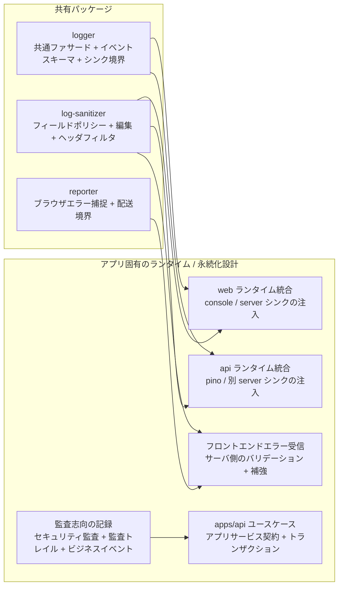
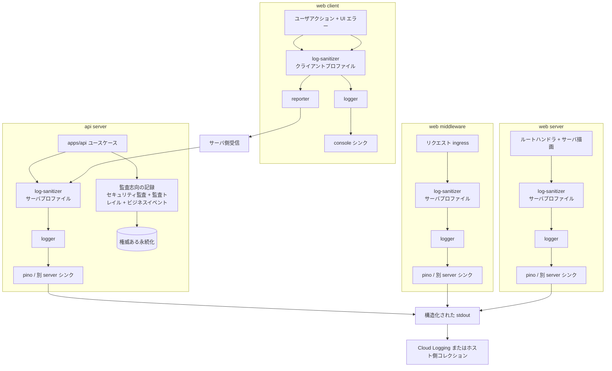

# ロギングと監査の境界

本ドキュメントは Issue #132 の成果物である。

目的は、FocusBuddy の Web ランタイムと API ランタイムにおいて、共通ロギングと監査志向の記録の責務をどのように分けるかを示すことである。

## スコープ

本ドキュメントが定めるもの:

- `logger` / `log-sanitizer` / `reporter` / 監査志向の記録 の責務分割
- それらの関心が `web client` / `web middleware` / `web server` / `api server` でどう使われるか
- 共有パッケージとアプリ固有のランタイム / 永続化ロジックとの境界

本ドキュメントが定めないもの: 最終的な Prisma スキーマ、最終的な監査トレイルテーブル設計、最終的なホスティング実装。

## 現状補足

本書時点で `packages/logger` のみが実装済みで、`packages/log-sanitizer` および `packages/reporter` はまだ実装されておらず、後述する「shared package 候補」の段階にある。本ポリシーは、これらが将来パッケージ化される際の責務境界を先に固定する目的で書かれている。

## 現状の責務分割

FocusBuddy では、共通 logger パッケージを「可観測性と監査の唯一の解」として扱わない。

現状の分割:

- `logger`: 共通の構造化ログのエントリポイント、イベントスキーマ層、シンクアダプタ境界
- `log-sanitizer`: 共有のフィールドポリシー、編集（redaction）、ヘッダフィルタ、プロファイル別のサニタイズルール
- `reporter`: ブラウザ側の例外捕捉とフロントエンド失敗の配送境界
- 監査志向の記録: セキュリティ監査ログ・監査トレイル・ビジネスイベントの権威ある記録

最初の 3 つは共有パッケージの良い候補である。

監査志向の記録は、最初から package-first で設計してはならない。権威ある挙動は `apps/api` のユースケース、トランザクション境界、永続化ルールに依存するためである。

## 各責務の詳細

### `logger`

- アプリケーションコードが使う共通ロギングファサードを提供する
- 構造化ログエントリをリポジトリ全体で 1 つの形式に整える
- 安定したイベント名・フィールドのためのイベントスキーマ定義をサポートする
- 具体的なランタイムが `pino` / ブラウザ `console` / 別のログライタを差し込めるシンクアダプタ境界を露出する
- Cloud Logging などデプロイ環境固有のコレクションは所有しない

### `log-sanitizer`

- 運用ロギングで許可・禁止するフィールドのポリシーを定める
- 生ヘッダ・秘密値・トークン・安全でない自由形式データをサニタイズまたは除去する
- クライアント可視ログとサーバ側ログで異なるポリシーを適用する
- `logger` と `reporter` に共通のサニタイズ入口を与える
- ビジネス上の意味やトランザクション境界は決めない

### `reporter`

- 通常の運用ロギングだけでは確実に保全できないブラウザ側エラーを捕捉する
- バックエンド受信境界へ配送するエラーレポートを準備する
- 通常のブラウザ向け開発者ログとは別物
- ペイロード配送前に `log-sanitizer` を再利用する
- 権威ある監査トレイルやビジネスイベントストアとして扱わない

### 監査志向の記録

本ドキュメントでは、関連はするが別個の 3 つの関心に対し 1 つの傘語を用いる:

- セキュリティ監査ログ: 認証失敗・認可失敗・権限変更などのセキュリティ関連イベント
- 監査トレイル: 「誰が何をいつ変更したか」の追記専用記録
- ビジネスイベント: セキュリティ専用パスの外側のドメイン上重要なイベント

これらの記録は、共有ランタイムロギングよりも `apps/api` 内のアプリケーションサービス契約に近い。

通常以下が必要となる:

- ユースケースを意識したイベント決定
- トランザクションを意識した永続化
- 追記専用または「新レコードによる訂正」のルール
- アクタ・対象・結果への権威ある関連付け

## 所有権の境界

## ランタイムごとの利用

### サマリ

| ランタイム      | `logger`                                           | `log-sanitizer`                                    | `reporter`                                          | 監査志向の記録                                                                                                              |
| --------------- | -------------------------------------------------- | -------------------------------------------------- | --------------------------------------------------- | --------------------------------------------------------------------------------------------------------------------------- |
| web client      | あり。通常の開発者向けロギングに使用              | あり。最厳のクライアントプロファイル              | あり。ブラウザ例外と reject された Promise の捕捉  | 権威ある永続化なし。ユーザアクションの起点記録のみ                                                                          |
| web middleware  | あり。構造化された ingress / 相関ログ             | あり。サーバ側プロファイル                         | なし                                                | 通常は権威ある永続化なし。運用 / セキュリティ関連の ingress シグナル発信のみ                                              |
| web server      | あり。構造化されたサーバログ                       | あり。サーバ側プロファイル                         | なし                                                | 限定的な利用。Web サーバがビジネス変更を所有する場合を除き、権威ある永続化は API 境界に残す                                |
| api server      | あり。構造化された運用ログ                         | あり。サーバ側プロファイル                         | なし                                                | あり。権威ある監査・ビジネス記録の主な配置場所                                                                              |

### ランタイムマップ

## GCP 系ホスティングでの運用解釈

デプロイ先が GCP 系のマネージドホスティングである場合、想定する運用パスは以下の通り:

- サーバ側ランタイムは `pino` または注入された別の server log writer を通じて構造化ログを出力する
- そのライタは `stdout` / `stderr` に出力する
- ホスティングプラットフォームがそれらのストリームを Cloud Logging やそれと等価なマネージドコレクタに収集する

したがって共有 `logger` パッケージは「構造化ログの境界」と「具体的なシンクの注入境界」までで止まる。

`logger` は以下を所有しない:

- Cloud Logging クライアント設定
- GCP プロジェクトのルーティング
- ログ保管期間ポリシー
- 監査トレイル永続化スキーマ

## 監査志向の記録が `apps/api` 寄りに残る理由

監査志向の記録は単なるシンクではない。

依存するのは:

- どのユースケースが実行されているか
- システムが権威と見なすアクタと対象は何か
- ミューテーションが成功したか失敗したか
- ビジネス変更と同一トランザクションで永続化する必要があるか
- 追記専用履歴として振る舞う必要があるか

そのため、権威ある設計点は通常、共有 logger パッケージではなく `apps/api` のアプリケーションサービス契約と永続化境界となる。

共有パッケージは将来、監査やビジネスイベントの共通契約 / ヘルパを保持してもよいが、`apps/api` の内部契約が把握できるまでは抽出を仮定しない。

## 経験則

- 運用可視性には `logger` を使う
- 共有された安全ポリシーには `log-sanitizer` を使う
- ブラウザエラー捕捉と配送には `reporter` を使う
- 権威あるセキュリティ・履歴・ビジネス記録には監査志向の記録を使う

1 つのユースケースで複数の記録が必要になることはあり得る。

例えば、1 回の API ミューテーションが以下を生むことがある:

- 運用ログエントリ
- セキュリティ監査記録
- 監査トレイル記録
- ビジネスイベント記録

これらは目的（運用 / 永続化）が異なるため、別個の記録として扱う。
