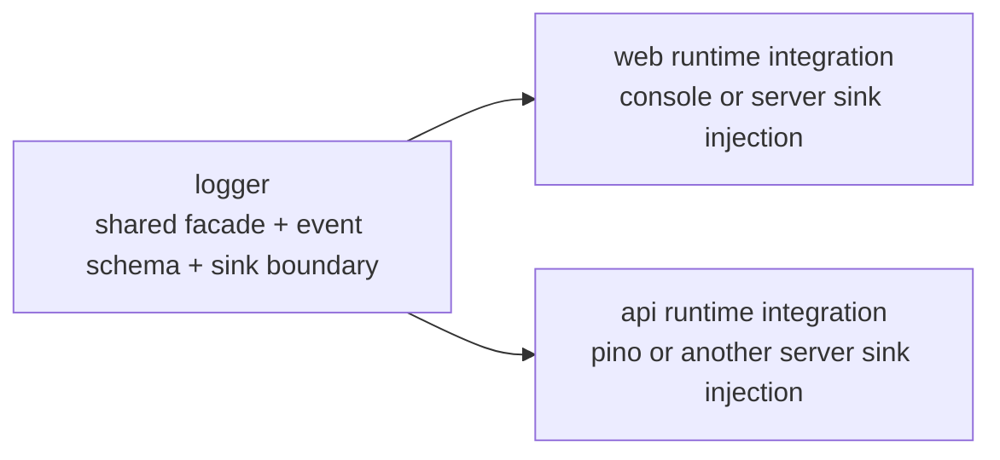
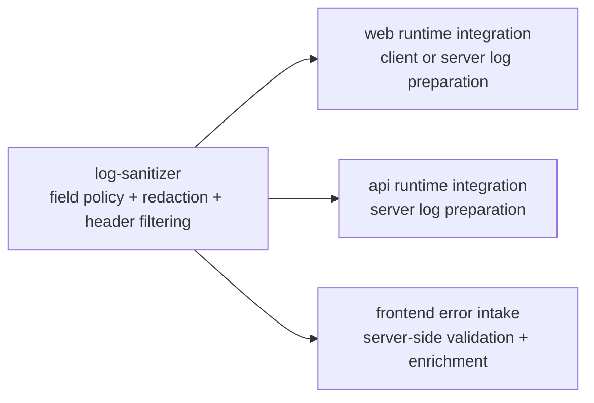
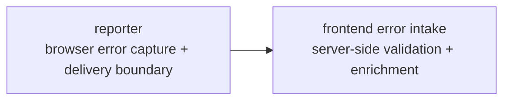
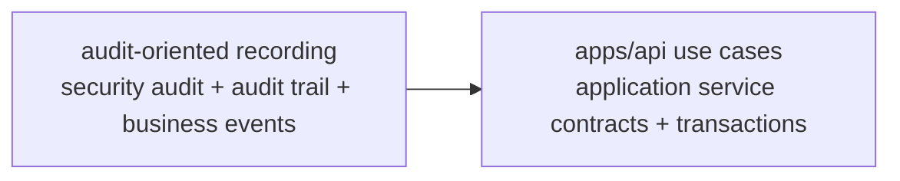
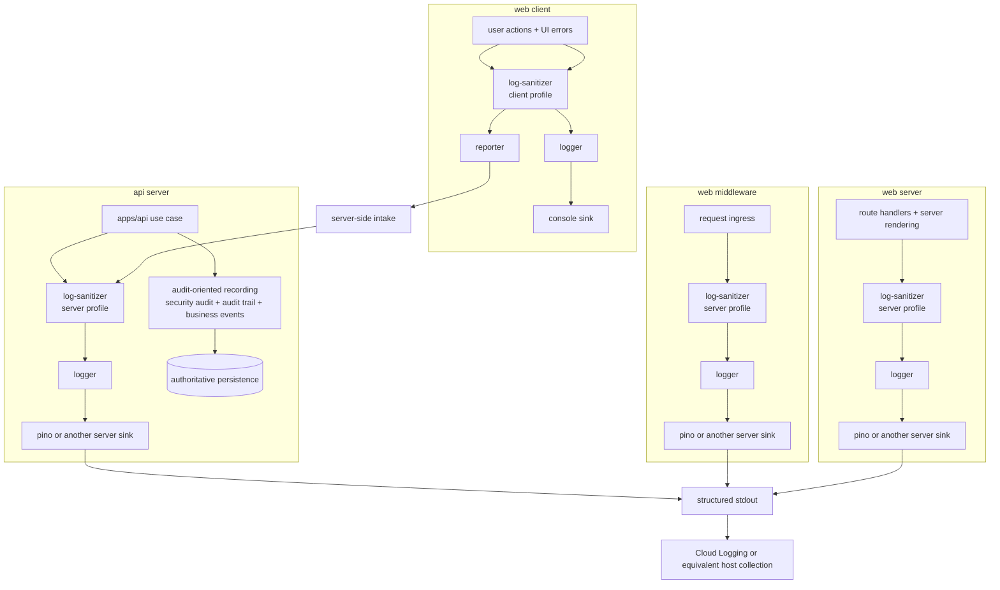

# Logging And Audit Boundaries

This document captures the output of issue #132.

Its purpose is to explain the current boundary between shared logging concerns and audit-oriented recording concerns across the FocusBuddy web and API runtimes.

## Scope

This document defines:

- the responsibility split between `logger`, `log-sanitizer`, `reporter`, and audit-oriented recording
- how those concerns are used across `web client`, `web middleware`, `web server`, and `api server`
- the current boundary between shared packages and app-local runtime or persistence logic

This document does not define the final Prisma schema, the final audit trail table layout, or the final deployed hosting implementation.

## Current split

FocusBuddy should not treat the shared logger package as the whole observability and audit solution.

The current split is:

- `logger`: shared structured-log entry point, event schema layer, and sink adapter boundary
- `log-sanitizer`: shared field policy, redaction, header filtering, and profile-specific sanitization rules
- `reporter`: browser-side exception capture and delivery boundary for frontend failures
- audit-oriented recording: authoritative recording for security audit logs, audit trails, and business events

The first three are good candidates for shared packages.

Audit-oriented recording should not be treated as a package-first design from the start. Its authoritative behavior depends on `apps/api` use cases, transaction boundaries, and persistence rules.

## Responsibility details

### `logger`

- provides the shared logging facade used by application code
- shapes structured log entries into one repository-wide format
- supports event schema definitions for stable event names and fields
- exposes a sink adapter boundary so concrete runtimes can inject `pino`, browser `console`, or another log writer
- does not own deployment-specific collection such as Cloud Logging itself

### `log-sanitizer`

- defines allowed and forbidden field policy for operational logging
- sanitizes or removes raw headers, secrets, tokens, and unsafe free-form data
- applies different policies for client-visible logs and server-side logs
- gives `logger` and `reporter` one shared sanitization entry point
- does not decide business meaning or transaction boundaries

### `reporter`

- captures browser-side errors that operational logging alone cannot reliably preserve
- prepares error reports for delivery to a backend intake boundary
- is distinct from normal browser developer logging
- should reuse `log-sanitizer` before payload delivery
- should not be treated as the authoritative audit trail or business-event store

### Audit-oriented recording

This document uses one umbrella term for three related but distinct concerns:

- security audit logs: security-relevant events such as authentication failures, authorization failures, or privilege changes
- audit trails: append-only records of who changed what and when
- business events: domain-significant events outside the security-only path

These records are closer to `apps/api` internal application service contracts than to shared runtime logging.

They usually need:

- use-case-aware event decisions
- transaction-aware persistence
- append-only or correction-by-new-record rules
- authoritative linkage to actor, target, and outcome

## Ownership boundaries

The shared-package boundary is easier to understand when each concern is shown separately.

### Logger boundary

### Log-sanitizer boundary

### Reporter boundary

### Audit-oriented recording boundary

## Runtime usage

### Runtime summary

| Runtime | `logger` | `log-sanitizer` | `reporter` | audit-oriented recording |
| --- | --- | --- | --- | --- |
| web client | yes, for normal developer-visible logging | yes, with the strictest client profile | yes, for browser exceptions and rejected promises | no authoritative persistence; only user action origination |
| web middleware | yes, for structured ingress and correlation logs | yes, server-side profile | no | usually no authoritative persistence; may emit operational or security-relevant ingress signals only |
| web server | yes, for structured server logs | yes, server-side profile | no | limited local use; authoritative persistence should stay with the API boundary unless the web server owns the business mutation |
| api server | yes, for structured operational logs | yes, server-side profile | no | yes, this is the primary place for authoritative audit and business recording |

### Runtime map

## Operational interpretation for GCP-style hosting

If the deployed runtime is on GCP-style managed hosting, the current intended operational path is:

- server-side runtimes emit structured logs through `pino` or another injected server log writer
- that writer emits to `stdout` or `stderr`
- the hosting platform collects those streams into Cloud Logging or an equivalent managed collector

The shared `logger` package therefore stops at the structured-log boundary and concrete sink injection boundary.

It does not own:

- Cloud Logging client configuration
- GCP project routing
- log retention policies
- audit-trail persistence schema

## Why audit-oriented recording stays closer to `apps/api`

Audit-oriented recording is not just another sink.

It depends on:

- which use case is being executed
- what actor and target the system considers authoritative
- whether a mutation succeeded or failed
- whether the record must be persisted in the same transaction as the business change
- whether the record must behave as append-only history

Because of that, the authoritative design point is usually the `apps/api` application service contract and persistence boundary, not the shared logger package.

Shared packages may later hold common contracts or helpers for audit and business events, but the first design should not assume extraction before the `apps/api` internal contract is understood.

## Rule of thumb

- use `logger` for operational visibility
- use `log-sanitizer` for shared safety policy
- use `reporter` for browser error capture and delivery
- use audit-oriented recording for authoritative security, history, and business records

If one use case needs multiple records, that is expected.

For example, a single API mutation may produce:

- an operational log entry
- a security audit record
- an audit trail record
- a business event record

Those are separate records because they serve different operational and persistence goals.
